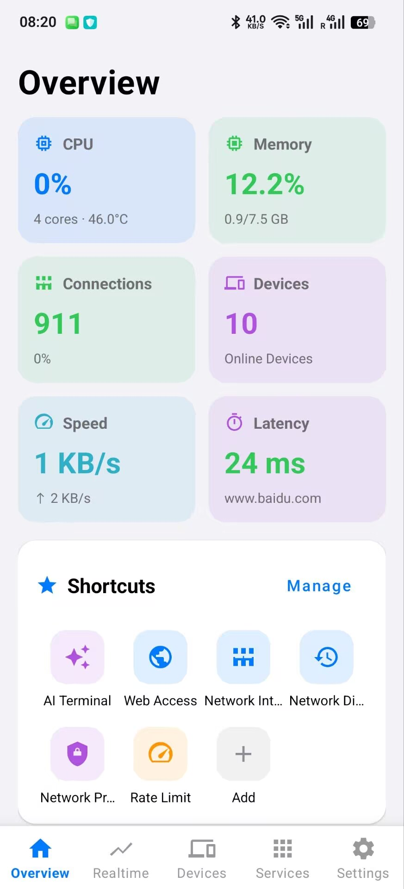
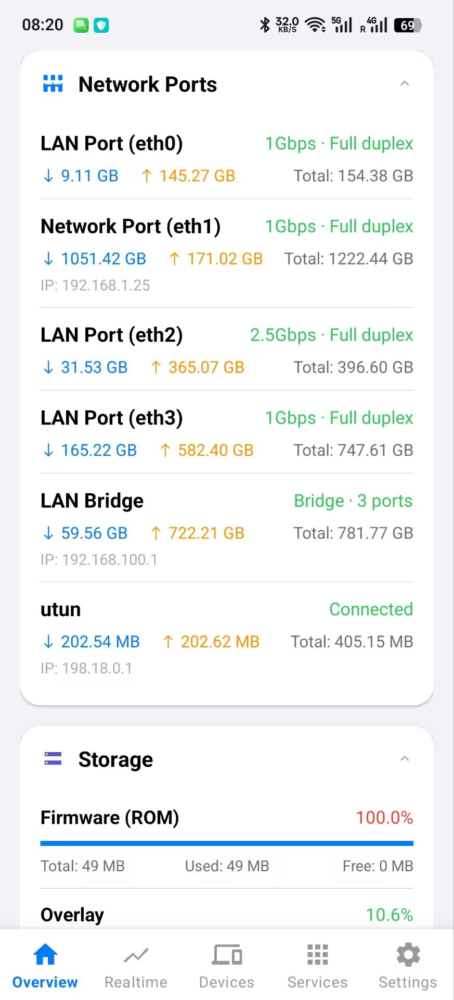
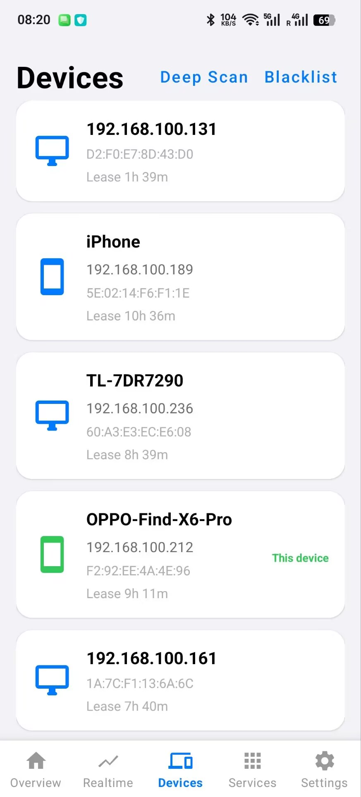
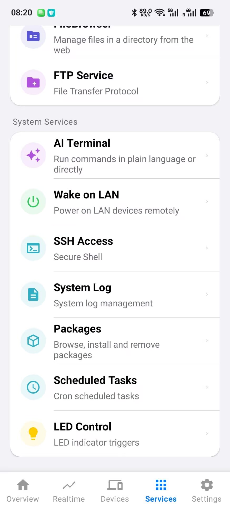
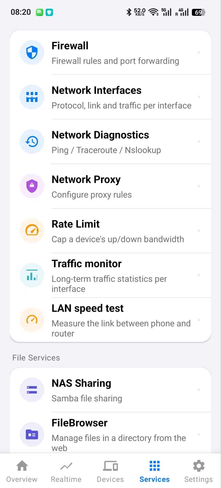
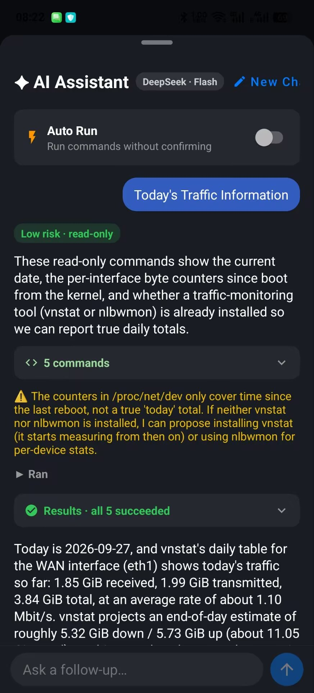

<div align="center">

# WrtHub for Android

**English** | [简体中文](README.zh-CN.md)

A native Android app for managing OpenWrt / ImmortalWrt routers from your phone.

</div>

> 📱 **Using an iPhone?** WrtHub is also on the App Store — just search for **WrtHub** there.

## Screenshots

<p align="center">
  
  
  
</p>
<p align="center">
  
  
  
</p>

## Features

**Overview**
- Dashboard with CPU, memory, temperature, connections, latency and live traffic; choose which cards appear on the home screen
- Real-time traffic charts per interface
- Connected devices with custom names, plus a blacklist to block devices from the network
- Config backup and firmware upgrade
- Home screen widget

**Network**
- Firewall: port forwards and traffic rules
- Network interfaces: protocol, link state and traffic
- Diagnostics: Ping / Traceroute / Nslookup
- Proxy (OpenClash)
- Per-device rate limiting (eqos)
- Traffic monitor with long-term statistics (vnStat)
- LAN speed test between your phone and the router
- Wi-Fi settings, scanning and relay

**Files**
- NAS sharing (Samba)
- FileBrowser
- FTP (vsftpd) with a built-in file browser

**System**
- **AI Terminal** — a full terminal (ttyd) with an AI assistant: describe what you want in plain language, review the suggested commands, and the app runs them and summarizes the results. Powered by DeepSeek with your own API key; an optional auto-run mode is off by default.
- Wake on LAN (etherwake / wol)
- SSH settings
- System and kernel logs
- Package manager (opkg / apk)
- Scheduled tasks (cron)
- LED configuration

Features that depend on router packages are greyed out when the package isn't installed, and offer a shortcut to install it from the package manager.

## Requirements

- Android 8.0 (API 26) or later
- An OpenWrt-based router (OpenWrt, ImmortalWrt, …) with LuCI and rpcd, reachable from your phone
- Optional router packages, only for the features that use them: `luci-app-ttyd`, `luci-app-wol`, `luci-app-vnstat2`, `luci-app-openclash`, `luci-app-eqos`, `samba4`, `vsftpd`, `luci-app-filebrowser`

## How it works

The app talks to the router the same way the LuCI web interface does — through ubus JSON-RPC (`/ubus`) with your router login — so no extra agent is needed on the router. Router credentials and the AI API key are stored encrypted on the device (EncryptedSharedPreferences).

## Build

1. Install Android Studio (or JDK 11+ and the Android SDK).
2. Clone this repository and open it in Android Studio, or build from the command line:

   ```bash
   ./gradlew assembleDebug
   ```

   The APK is written to `app/build/outputs/apk/debug/`.

3. Run the unit tests:

   ```bash
   ./gradlew testDebugUnitTest
   ```

## Project layout

```
app/src/main/java/com/whykangkang/wrthub/
├── api/        Router API (ubus / LuCI / cgi-io), AI assistant, plugin detection
├── manager/    Device list, settings, favorites, service catalog
├── model/      Data models
├── ui/         Screens: dashboard, realtime, devices, services, settings
├── widget/     Home screen widget
└── util/       Helpers
app/src/main/assets/   AI system prompt and the ttyd terminal bridge script
```

## License

Copyright (C) 2026 Wang Hongyue ([whykang](https://github.com/whykang))

WrtHub for Android is free software: you can redistribute it and/or modify it under the terms of the [GNU General Public License v3.0](LICENSE) as published by the Free Software Foundation.

In short: you may use, study, modify and share this code, but if you distribute an app based on it, you must release its full source code under GPL-3.0 as well and keep this copyright notice. It comes with no warranty.
